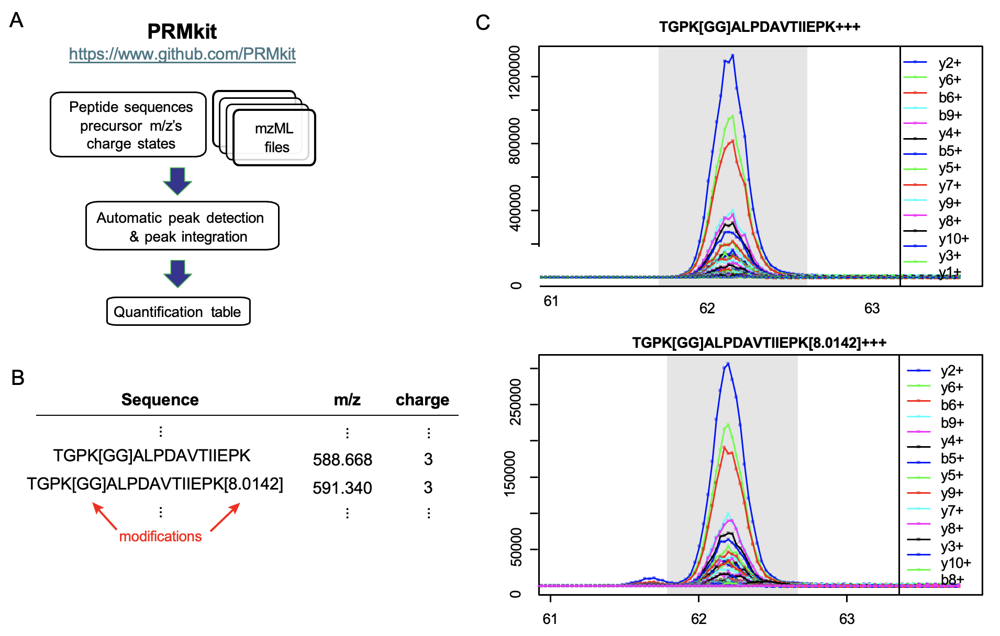

# PRMkit
For compiled executable, please go to [Releases](https://github.com/PRMkit/PRMkit/releases/latest) page. 

Quantification of peptide peak area integration by PRMkit (A) Schematic of PRMkit chromatogram extraction and peak integration. (B) Example of peptide sequences, precursor m/z, and charge states required as input for PRMkit. (C) Example of PRMkit identification the uS3.K200 biological (TGPK[GG]ALPDAVTIIEPK+++) and heavy-labeled (TGPK(GG)ALPDAVTIIEPK[8.0142]+++) peptide y and b ion transitions in decreasing order of integrated peak area. Gray rectangle shows the range of integration in each window.
